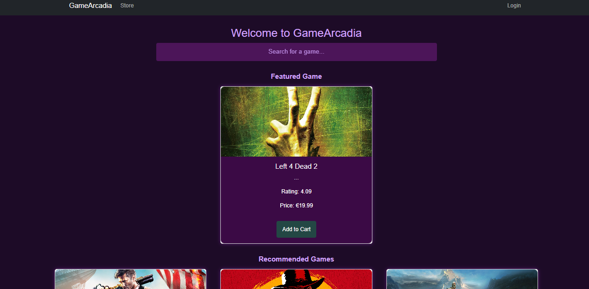

# GameArcadia

A neural recommendation-based game marketplace platform built with React.



## Overview

GameArcadia represents the fusion of cutting-edge technology and gaming passion. We've built a neon-lit marketplace where gamers can discover titles that resonate with their unique tastes through our neural recommendation systems.

## Features

- **Neural Game Recommendations**: Personalized game suggestions based on user preferences and gaming history
- **User Authentication**: Secure signup, login, and profile management
- **Game Discovery**: Browse games by genre, popularity, ratings, and more
- **Shopping Cart System**: Add games to cart and checkout securely
- **Stripe Payment Integration**: Secure payment processing
- **User Inventory**: Track owned games in your personal library
- **Responsive Design**: Neon-themed UI that works on different screen sizes
- **Admin Dashboard**: Manage games, users, and platform data (admin users only)
- **Order History**: View past purchases and transaction details

## Tech Stack

- **Frontend**: React, React Router, Bootstrap
- **State Management**: React Context API
- **APIs**: RAWG API for game data
- **Database**: Supabase
- **Authentication**: Supabase Auth
- **Payment Processing**: Stripe
- **Testing**: Jest, React Testing Library

## Installation Guide

### Prerequisites

- Node.js (v14 or higher) and npm (v6 or higher)
- Supabase account with project setup
- Stripe account with API keys
- RAWG API key

### Environment Variables

Create a `.env` file in the root directory with the following:

```bash
REACT_APP_SUPABASE_URL=your_supabase_url
REACT_APP_SUPABASE_ANON_KEY=your_supabase_anon_key
REACT_APP_RAWG_API_KEY=your_rawg_api_key
REACT_APP_STRIPE_PUBLISHABLE_KEY=your_stripe_publishable_key
```

### Setup

1. **Clone the repository**:
   ```bash
   git clone https://github.com/your-username/gamearcadia.git
   cd gamearcadia
   ```
2. **Install dependencies**:
   ```bash
   npm install
   ```
3. **Start the React development server**:
   ```bash
   npm start
   ```
4. **Start the Stripe server** (in a separate terminal):
   ```bash
   cd stripe-server
   npm install
   node server.js
   ```

### Running Tests

```bash
npm test
```

## Project Structure

```
gamearcadia/
├── components/       # React components
├── contexts/         # React contexts (e.g., CartContext)
├── styles/           # CSS/SCSS stylesheets
├── tests/            # Test files
├── stripe-server/    # Stripe payment backend
└── public/           # Public assets (e.g., images, index.html)
```

## Project Demo
https://www.youtube.com/watch?v=a8zSm5TNe9o

## Stripe Help
- https://docs.stripe.com/testing
- 4000003720000005

## Acknowledgments

- [RAWG API](https://rawg.io/apidocs) for comprehensive game data
- [Stripe](https://stripe.com/docs/api) for payment processing
- [Supabase](https://supabase.io/docs) for backend services

